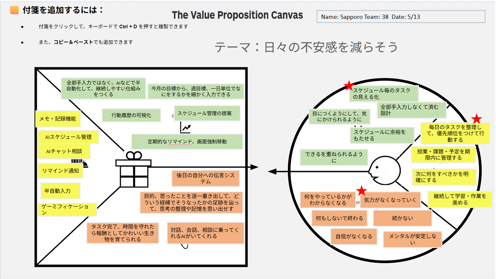

# VPC v1

## テーマ
日々の不安感を減らそう

## 顧客セグメント (Customer Profile)

### Customer Jobs (顧客の課題・やるべきこと)
- 毎日のタスクを整理して、優先順位をつけて行動する
- 授業・課題・予定を期限内に管理する
- 次に何をすべきかを明確にする
- 継続して学習・作業を進める

### Pains (顧客の悩み・苦痛)
- 何をやっているかがわからなくなる
- 何もしないで終わる
- 気力がなくなっていく
- 続かない
- 自信がなくなる
- メンタルが安定しない

### Gains (顧客の恩恵・理想の姿)
- スケジュール毎のタスクの見える化
- 目につくようにして、気っかけられるように
- 全部手入力しなくて済む設計
- スケジュールに余裕をもたせる
- できるを重ねられるように

---

## バリュープロポジション (Value Proposition)

### Products & Services (製品・サービス)
- メモ・記録機能
- AIスケジュール管理
- AIチャット相談
- リマインド通知
- 半自動入力
- ゲーミフィケーション

### Pain Relievers (悩みを解決するもの)
- 後日の自分への伝言システム
- 目的、思ったことを逐一書き出して、どういう経緯でそうなったかの足跡を辿って、思考の整理や記憶を思い出せす
- タスク完了、時間を守れたら報酬としてかわいい生き物を育てられる
- 対話、会話、相談に乗ってくれるAIがいてくれる

### Gain Creators (恩恵を生み出すもの)
- 全部手入力ではなく、AIなどで半自動化して、継続しやすい仕組みをつくる
- 行動履歴の可視化
- 今月の目標から、週目標、一日単位でなにをするかを細かく入力できる
- スケジュール管理の提案
- 定期的なリマインド、画面強制移動
